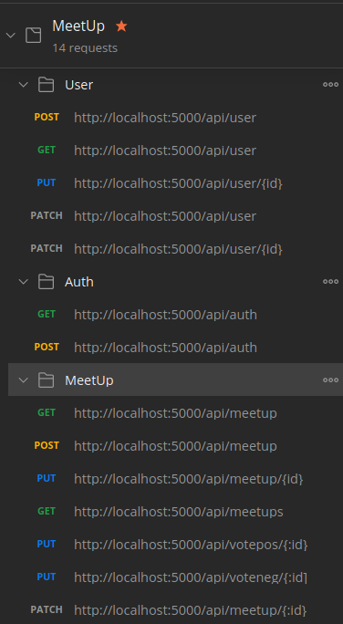

# Meetup App with MERN stack

## Install instructions

- Download project from github repository [meetup](https://github.com/hugoisrr/meetup)
- Run `npm i` with in the project, to install server
- Run `npm run clientinstall` to install client
- Run `npm run dev` to run development environment (Client & Server)
- Run `npm run server` to run only server
- Database is located in a free Mongo Atlas Cloud server

## RestAPI routes finished

## UI features finished

- Create MeetUp
- Create User
- Update MeetUp
- Update User
- Login
- State Management (Context API)
- Alerts
- Auth
